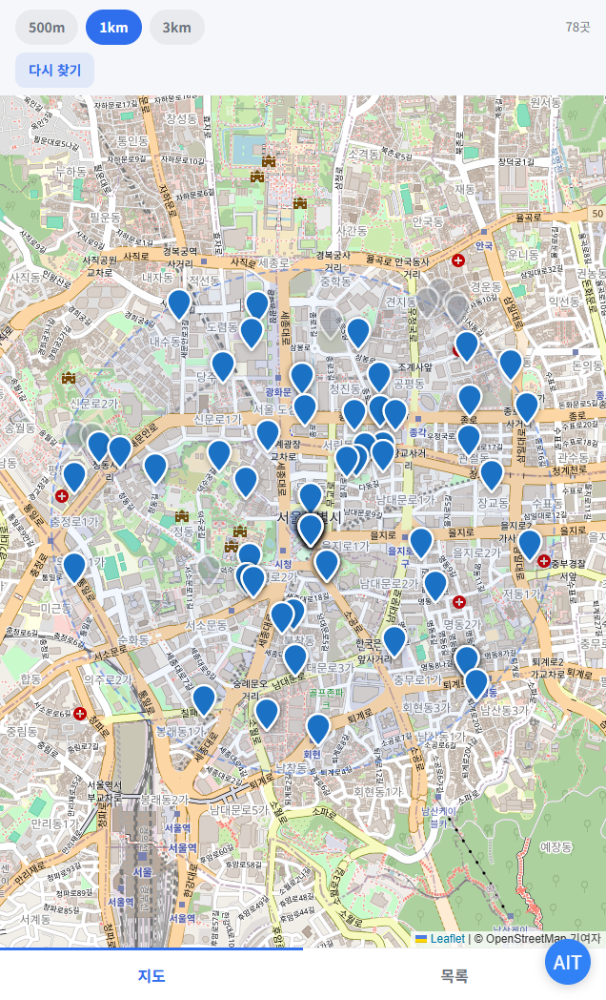
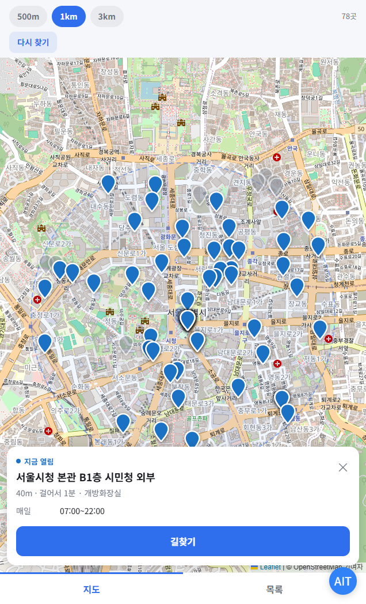

<div align="center">

# 🚽 급똥 화장실 지도 (toilet-near)

**가까운 열린 화장실 찾기 — 지금 열려 있는 공중화장실을 가까운 순으로**

[](https://react.dev)
[](https://www.typescriptlang.org)
[](https://vitejs.dev)
[](https://leafletjs.com)
[](https://apps-in-toss.toss.im)

토스 앱 속 WebView 미니앱 · 비게임 · 광고 수익형 · 서버 없음

</div>

---

## 🎯 한눈에 보기

> 열면 **바로 내 위치를 잡고** → 주변 화장실을 지도와 목록에 뿌리고 → **지금 열린 곳을 위로** 올려서 → 누르면 길찾기로 넘깁니다.

| | |
|---|---|
| **무엇을** | 전국 공중화장실 47,921곳을 내 주변부터, **지금 열려 있는지까지** 함께 보여줘요 |
| **어디서** | 토스 앱 내 미니앱 (화면 1개, 지도·목록 탭) |
| **누구를 위해** | 밖에서 급해진 사람. 검색할 여유가 없는 그 몇십 초 |
| **누가** | 1인 기획·개발 (프론트엔드 + 공공데이터 지오코딩 배치 + 심사/정책 대응) |

## 📸 화면

| 지도 | 목록 |
|---|---|
|  |  |

| 상세 | 반경 안에 없을 때 |
|---|---|
|  |  |

## ✨ 핵심 기능

| | |
|---|---|
| **열자마자 찾기** | 버튼을 누르게 하지 않아요. 화면이 뜨는 즉시 위치를 잡고 주변을 채웁니다 |
| **지금 열림 / 닫힘 / 모름** | 개방시간을 요일까지 따져 세 상태로 표시. 색만 쓰지 않고 글자로도 적어요 |
| **열린 곳 우선 정렬** | 반경 안에서 열린 곳 → 모름 → 닫힘 순, 그 안에서 가까운 순 |
| **반경 500m · 1km · 3km** | 급할 때 고를 거라 세 개면 충분해요. 지도 배율도 반경에 맞춰 따라와요 |
| **다시 찾기** | 이동 중에 앱을 껐다 켜지 않아도 위치와 목록만 새로 받아요 |
| **길찾기** | 카카오맵으로 넘겨요. 앱이 깔려 있으면 앱으로, 없으면 웹으로 열려요 |

---

## 🗺 이 데이터에는 좌표가 없습니다

이 프로젝트에서 가장 오래 걸린 일은 화면이 아니라 **좌표 찍기**였어요.

원본은 행정안전부 [전국공중화장실표준데이터](https://www.data.go.kr/data/15012892/standard.do) 입니다.
**2025년 2월 원천데이터 정책이 바뀌면서 이 표준데이터에서 WGS84 위도·경도 제공이 중단됐어요.**
5만 건이 넘는 줄에 주소만 남아 있어서, 지도에 찍으려면 전부 직접 지오코딩해야 했습니다.

### 왜 VWorld 인가 — 선택지가 하나뿐이었어요

| 지오코더 | 결과를 파일로 저장·재배포 | 결론 |
|---|---|---|
| 카카오 · 네이버 | **약관상 금지** | 원장을 만들 수 없어요 |
| 국토교통부 **VWorld** | 공공데이터라 가능 | 이걸 씁니다 |

이 앱은 좌표를 격자 파일로 구워서 배포하는 구조라, "저장하면 안 되는" 지오코더는 애초에 후보가 아니었어요.
(길찾기는 카카오맵 **링크로 넘기는** 것이라 저장과 무관합니다.)

### 하루 4만 건 한도 — 이틀에 걸쳐 돌렸어요

VWorld 지오코더는 **하루 4만 건**이고 자정(KST)에 초기화됩니다. 대상이 5만 건이 넘어서 하루에 끝나지 않아요.
그래서 결과를 `scripts/.geocache.json` 에 쌓아두고, 다음 날 같은 명령을 다시 쳐서 이어 붙였습니다.

최종적으로 **47,921곳**의 좌표를 확보했고 **3,533칸**의 격자가 나왔어요.
좌표를 못 찾은 **4,579줄**은 주소 자체가 비어 있거나, 도로명·지번 어느 쪽으로도 VWorld 에 없는 주소입니다.

### 한도 처리에서 실제로 만난 함정 두 가지

**(a) 한도 초과를 일시 장애와 구분하지 않았어요.**
VWorld 는 한도를 다 쓰면 `OVER_REQUEST_LIMIT` 으로 답합니다. 이건 내일이 되기 전에는 절대 안 풀려요.
그런데 이 응답을 502 같은 일시 장애와 같은 자리에 묶어놨더니, **한도에 걸린 뒤에도 주소마다 네 번씩 재시도하면서 쉬는 시간까지 넣고** 있었습니다. 지금은 이 코드를 만나는 즉시 접습니다.

**(b) 한도를 만나면 배치를 통째로 접었어요.**
그러면 뒤에 남은 줄들이 **이미 캐시에 있어도 같이 버려집니다.** 그래서 격자가 실제로 확보한 좌표보다 작게 나왔어요.
고친 뒤에는 한도를 만나면 **네트워크만 끊고 캐시로 끝까지 훑습니다.** 같은 캐시로 **34,388 → 34,761곳**이 됐습니다.

### 일시적 실패를 캐시하면 안 됩니다

처음에는 실패도 전부 캐시에 남겼어요. 그랬더니 **잠깐의 서버 오류가 영구 실패로 굳어서**, 다시 돌려도 그 주소는 영영 안 찍혔습니다. 성공률이 50% 에서 더 안 올라간 원인이었어요.

지금은 **"그 주소는 없다"(`NOT_FOUND`)만 캐시**합니다. 서버 오류·소켓 끊김은 캐시하지 않고 다음 실행에서 다시 시도해요.
같은 이유로 도로명이 안 되면 지번으로 한 번 더 물어봅니다 — 지번만 있는 줄을 도로명 파서에 넣으면 전부 `NOT_FOUND` 로 떨어져서, 그것만으로 성공률이 61% 에 묶여 있었어요.

> 순간 부하 제한도 따로 있어서, 동시 호출은 2개로 두고 서버가 밀어내면 모든 워커가 함께 쉬었다 이어갑니다.
> 동시 6개로 올렸더니 502 가 나기 시작했고, 같은 키를 쓰던 지도 타일까지 함께 막혔어요.

---

## 🧱 0.05도 격자로 쪼갭니다

전국 좌표를 한 파일로 두면 앱이 못 씁니다. 그래서 위·경도 **0.05도**(위도로 약 5.5km, 경도로 약 4.5km) 격자로 잘라
`public/data/cells/{y}_{x}.json` 로 저장하고, 앱은 **내 위치를 둘러싼 3×3 칸**만 읽어요.

```
public/data/cells/665_2530.json   ← Math.floor(위도/0.05)_Math.floor(경도/0.05)
[[37.5665,126.9780,"○○공원 화장실","0900-1800|",0], …]
```

- 한 줄은 객체가 아니라 **배열** — `[위도, 경도, 이름, 개방시간, 종류]`. 4만 건이 넘어서 키 이름값이 아까워요.
- 내 칸만 읽으면 안 돼요. 칸 가장자리에 서 있으면 **옆 칸에 있는 화장실이 더 가깝습니다.**
- 바다·산처럼 화장실이 하나도 없는 칸은 **파일 자체가 없어요. 404 는 정상**이고 빈 배열로 처리합니다.
- 반경 필터는 파일을 읽은 뒤 화면에서 겁니다. 반경 칩을 누를 때마다 파일을 다시 읽지 않으려고요.

**미개방으로 적힌 곳과 이동화장실은 아예 뺐습니다.** 미개방을 "시간 정보 없음"으로 두면 열린 곳 바로 아래에 올라와 헛걸음을 시키고, 이동화장실은 행사용 임시 설치라 주소로 찍은 좌표를 믿을 수 없어요.

---

## 🕘 개방시간 파싱 — 빈 칸은 "모름"이 아니라 "닫음"

개방시간 칸은 자유 텍스트예요. 실제로 이런 값들이 들어 있습니다.

```
"상시"  "정시 09:00~18:00"  "(평일)09:00-18:00+(주말)상시닫힘"
"평일,주말: 06:00~24:00"  "09:00~18:00 주말및공휴일 미개방"  "정시 9시간"  "불규칙"
```

배치가 이걸 **다섯 가지 모양**으로만 줄여두고(`scripts/build-toilets.mjs` 의 `normalizeHours`), 앱(`src/lib/hours.ts`)은 줄여진 값만 봅니다.

| 값 | 뜻 |
|---|---|
| `24` | 24시간 |
| `0900-1800` | 요일 상관없이 같은 시간 |
| `0900-1800\|1000-1700` | 평일 \| 주말·공휴일 |
| `0900-1800\|` | **평일만 — 주말은 닫힘** |
| `` (빈 문자열) | 모름 |

여기서 갈리는 게 **"닫음"과 "모름"** 입니다. 주말 칸이 비어 있으면 그날은 닫는다는 뜻이라 `closed` 로 판정해요.
둘을 뭉뚱그리면 "열려 있다고 해서 갔는데 잠겨 있는" 최악의 경우가 나옵니다.

그 밖에 실제 데이터에서 걸렸던 것들:

- `00:00~24:00` 은 하루 종일이라 `24` 로, `06:00~24:00` 의 `24:00` 은 자정이라 `0000` 으로 접어요 — `2400` 으로 두면 앱이 못 읽어요.
- `22:00~04:00` 처럼 **자정을 넘기는 구간**은 끝이 시작보다 작습니다. 두 구간의 합집합으로 판정해요.
- `"정시 9시간"` 은 시각 범위가 아니라 **길이**예요. 범위로 못 읽히면 "모름"입니다.
- `(토)` 를 정규식 `토\)` 로 쓰면 `(평일)` 의 `일)` 에도 걸려요. 여는 괄호까지 요구합니다.
- 형식이 깨진 값(`9-18`, `2500-2600`)은 **"열림"이 아니라 "모름"** 으로 떨어뜨립니다.
- ⚠️ 공휴일 달력이 없어서 **공휴일은 주말과 같이 봅니다.** 평일에 쉬는 공휴일을 "열림"으로 보여줄 수 있어요.

이 판정이 이 앱의 유일한 진짜 로직이라 자체 점검을 붙여뒀습니다.

```bash
npm run check:hours   # src/lib/hours.ts 의 demo() — 30개 케이스
node scripts/build-toilets.mjs --check   # 파싱·주소 다듬기 케이스
```

테스트에 쓰는 문자열은 전부 **실제 CSV 에서 그대로 가져온 값**입니다.

---

## 🔁 매달 자동 갱신

화장실은 새로 생기고 없어져요. 갱신 배치는 앱 저장소가 아니라 공개 저장소
[**garsu-garsu/ait-data**](https://github.com/garsu-garsu/ait-data) 에 두고, **매달 1일 GitHub Actions** 가 돌립니다.
결과는 GitHub Pages 로 나갑니다 — https://garsu-garsu.github.io/ait-data/toilet/meta.json

받아오는 쪽에도 함정이 있었어요.

- 이 데이터셋은 **오픈API 가 없습니다.** `file.localdata.go.kr` 의 **CSV 직접 다운로드만** 됩니다.
- 그 주소는 브라우저처럼 요청해야 줘요. **`Accept-Language: ko-KR` 헤더**와 UA·리퍼러가 없으면 403 입니다.
- 막히면 CSV 대신 에러 페이지가 오는데 이것도 200 이에요. 그래서 **파일 크기가 10MB 미만이면 실패로 처리**합니다(정상은 16MB 안팎).
- CSV 는 **cp949** 이고, 개방시간이 `개방시간구분`("상시"/"정시")과 `개방시간상세`("10:30-20:30") **두 칸으로 나뉘어** 있어요. 두 칸을 붙여서 파서에 넘깁니다.
- 지오코딩 캐시(`.geocache.json`)를 저장소에 커밋해둡니다. 그래야 매달 **새로 생긴 주소만** VWorld 를 부르고, 4만 건 한도에 걸리지 않아요.
- 격자가 그대로면 커밋하지 않습니다. 안 바뀐 파일 수천 개를 매달 다시 올릴 이유가 없어요.

---

## 🙈 반경 안에 화장실이 없을 때

이 앱에서 제일 절망적인 순간이라 화면을 따로 만들었습니다.
**"늦었습니다"** 와 함께 만화 그림 하나를 띄워요(`src/components/NoToilet.tsx`).

- 이미지 파일이 아니라 **SVG 로 직접 그렸어요.** 파일이 없어도 항상 뜹니다.
- **뒷모습이라 얼굴이 없어요.** 그래도 무슨 상황인지 바로 읽힙니다.
- 지도 탭에서는 지도를 완전히 가리지 않고 반투명하게만 덮어요. 그리고 "반경을 넓혀보세요"로 다음 행동을 알려줍니다.

급할 때 여는 앱이라, 아무것도 못 찾은 화면을 빈 화면으로 두고 싶지 않았어요.

---

## 📺 광고

| 자리 | 형태 | 갱신 |
|---|---|---|
| 화면 하단 고정 (앱 전체 1개) | 문구 강조형 배너 | 30초 |
| 목록 탭 맨 아래 | 이미지 강조형 배너 | 30초 |

30초인 이유: 토스 배너는 AdMob 기반이고, **AdMob 은 30초보다 잦은 갱신을 무효 트래픽으로 봅니다.**
화면이 가려져 있는 동안(`visibilitychange`)에는 갱신을 멈춰요 — 안 보이는 동안 돌리면 노출로 잡히지 않고 호출만 쌓입니다.

이미지형 자리는 소재가 잘리지 않도록 고정 높이가 아니라 **최소 높이**로 잡았고, 반대로 하단 고정 배너는 위로 자라면 본문을 덮어서 높이를 고정합니다. 광고그룹 ID 가 비어 있으면 **자리 자체를 만들지 않아요** — 배너는 안 뜨는데 96px 여백만 남는 걸 막으려고요.

---

## 🛠 기술 스택

| 영역 | 사용 기술 |
|---|---|
| **언어** | TypeScript 5.7 (strict) |
| **프론트엔드** | React 18, Vite 6 |
| **지도** | Leaflet 1.9 + OpenStreetMap 타일 |
| **디자인 시스템** | TDS Mobile (토스 디자인 시스템) |
| **플랫폼 SDK** | `@apps-in-toss/web-framework` 3.0.2 (위치 · 인앱광고 · 외부 링크 · 이벤트 로그) |
| **데이터** | 빌드 시점에 구운 정적 격자 JSON — **서버 없음, 런타임 외부 API 없음** |
| **지오코딩(배치)** | 국토교통부 VWorld 지오코더 |
| **수익화** | 인앱 배너 광고 2지면 |

**지도 SDK 를 안 쓴 이유** — 이 앱에서 지도가 하는 일은 핀 찍기와 반경 원 그리기가 전부예요.
Leaflet(약 40KB) + 타일 주소 한 줄이면 끝나고, 인증키도 도메인 등록도 필요 없습니다. 타일 주소만 바꾸면 지도를 통째로 갈 수 있어요.

**타일을 VWorld 가 아니라 OSM 으로 둔 이유** — VWorld 타일도 되지만 키 하나를 지오코딩 배치와 나눠 쓰게 됩니다.
배치가 도는 동안 **지도가 502 로 통째로 막히는 걸 실제로 겪었어요.** 한도는 지오코딩에만 씁니다.
(⚠️ OSM 공식 타일 서버는 대량 트래픽을 허용하지 않아요. 사용자가 늘면 타일 제공자를 따로 두거나 직접 호스팅해야 합니다.)

**로그인·서버·개인정보 없음** — 필요한 권한은 위치 하나뿐이고, 위치는 기기 밖으로 나가지 않습니다. 저장하는 것도 없어요.

---

## 📁 구조

```
src/
├─ features/home/HomeScreen.tsx   위치 잡기 · 반경 · 지도/목록 탭 · 다시 찾기
├─ components/
│  ├─ MapView.tsx      Leaflet 지도 · 물방울 핀 · 반경 원 · 타일 실패 안내
│  ├─ DetailSheet.tsx  핀을 눌렀을 때 뜨는 상세(평일·주말 개방시간)
│  ├─ NoToilet.tsx     "늦었습니다" 그림 (SVG)
│  └─ BannerAd.tsx     배너 2종 · 30초 갱신 · 화면 가려지면 정지
├─ lib/
│  ├─ toilets.ts       격자 파일 읽기 · 거리 정렬 · 열린 곳 우선 · 길찾기 링크
│  ├─ hours.ts         개방시간 판정(열림/닫힘/모름) + 자체 점검
│  ├─ geo.ts           격자 키 · 3×3 이웃 칸 · 거리 · 도보 분
│  └─ env.ts           광고그룹 ID · 타일 주소
└─ App.tsx             화면 1개 셸 + 하단 고정 배너

scripts/
├─ build-toilets.mjs   CSV/오픈API → 지오코딩 → 개방시간 정규화 → 격자 저장
└─ check-hours.ts      개방시간 자체 점검 실행기

public/data/cells/     0.05도 격자 3,533칸 (화장실 47,921곳)
```

---

## 🚀 개발

```bash
npm install
npm run dev           # 브라우저 (광고는 자리 자체가 안 생기고, 위치는 표준 geolocation 으로 대체)
npm run check:hours   # 개방시간 판정 자체 점검
npm run typecheck
npm run lint
npm run build         # vite build + ait build → toilet-near.ait
npm run deploy
```

데이터를 다시 만들 때만 쓰는 명령입니다. 앱을 돌리는 데는 필요 없어요.

```bash
VWORLD_KEY=… node scripts/build-toilets.mjs data/공중화장실정보.csv   # CSV 로 격자 만들기
DATA_KEY=… node scripts/build-toilets.mjs --probe                      # 오픈API 응답 필드 확인
node scripts/build-toilets.mjs --check                                 # 파싱 자체 점검
```

`.env` 에 넣는 값은 광고그룹 ID(`VITE_AD_GROUP_ID_BANNER`, `VITE_AD_GROUP_ID_BANNER_IMAGE`)와
지오코딩용 `VWORLD_KEY` 입니다. 비워두면 배너는 그려지지 않고 앱은 그대로 동작해요.
`VITE_` 변수는 빌드 시점에 번들로 구워지니 값을 바꾸면 반드시 다시 빌드하세요.

---

<div align="center">
<sub>데이터: 행정안전부 전국공중화장실표준데이터 · 지도: © OpenStreetMap 기여자 · 좌표: 국토교통부 VWorld<br/>
현장 사정으로 닫혀 있을 수 있어요. 거리는 걷는 거리가 아니라 직선거리입니다.</sub>
</div>
